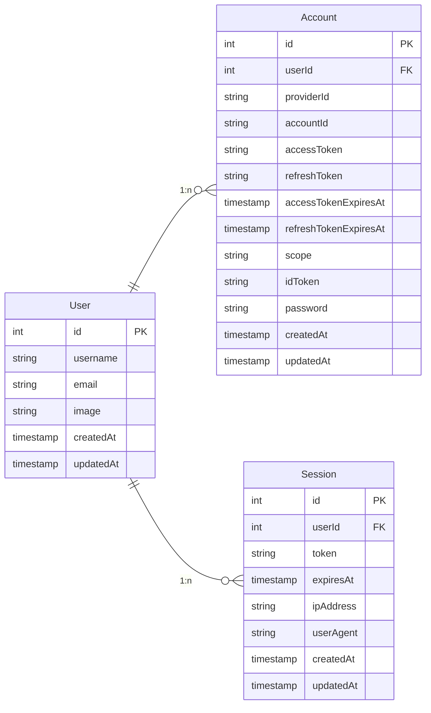

# Database

The database schema is illustrated in the entity relationship diagram below and
the purpose of each table is described below.

## Tables

### `Account`

Represents an account that is used to authenticate a [`User`](#user). Users may
have multiple accounts with different providers, one for each provider. This
allows users to log in with their preferred provider which could be local (i.e.,
username and password) or a social login (e.g., Google, GitHub, etc.).

### `Session`

Represents a unique [`User`](#user) login into the application as the `User`
could be logged in from multiple devices at the same time.

### `User`

Represents an individual who signed up for and intends to use the application.
